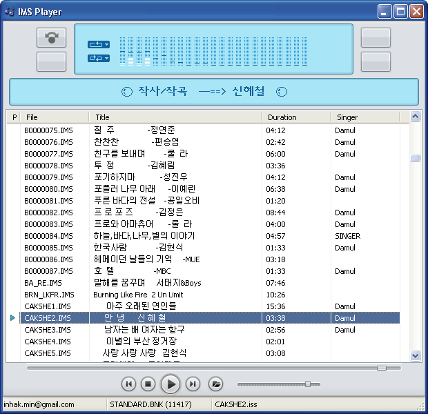

MS-DOS 시절에 많이 사용되던 애들립 카드의 사운드 포맷중의 하나인 IMS 플레이어입니다.
당시 애들립 카드는 대부분 야마하사의 YM3812 칩을 사용하였으며, IMS Player 에서는 이 칩을 소프트웨어적으로 시뮬레이션 합니다.
시뮬레이션이라 YM3812 칩과 100% 동일한 소리를 내지는 못하지만, 어느정도 동일한 소리 구현을 목표로 합니다.
또한 ISS 파일인 가사 파일도 지원합니다.
현재는 IMS 파일만 지원하지만, ROL 포맷도 지원할 예정입니다. 

# IMS 파일 지원

90년대 독보적이었던 경북대 하늘소 동아리의 IMS 포맷을 지원합니다. 

# ISS 파일 지원

IMS와 쌍으로 사용되었던 가사 파일을 지원하며, 특수문자 출력도 지원합니다. 

# 오픈 소스

IMS Player는 오픈 소스이며, SDL, wxWidgets을 이용하였으며 근본적으로 멀티플랫폼을 지원합니다. 

# 양해의 글

스킨을 만들 실력이 없어 제트오디오의 기본 스킨을 사용하였습니다.
제트 오디오 관계자 분께서 보시고 문제가 된다면 연락을 주시면 삭제토록 하겠습니다.
이 프로그램은 개발 버전이기에 완전히 구현이 되어 있지 않습니다.
프로그레스바와 볼륨바가 거꾸로 된것은 의도적입니다. 

# 참고 싸이트

* [http://imsplay.sourceforge.net/](http://imsplay.sourceforge.net/)
* [http://cafe.naver.com/imsplayer](http://cafe.naver.com/imsplayer)
* [http://madplug.sourceforge.net/](http://madplug.sourceforge.net/)
